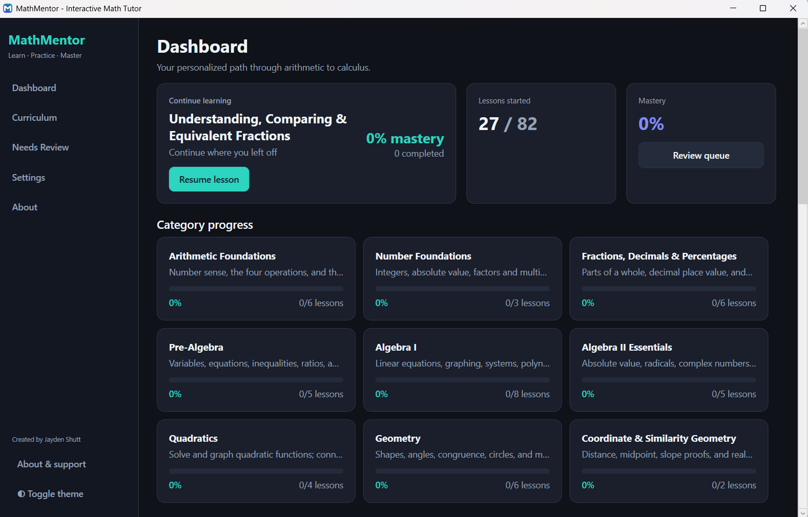

# MathMentor

**MathMentor** is a free, offline Windows desktop app that teaches mathematics from absolute basics through single-variable calculus. It is designed so a motivated learner can study independently: clear explanations, worked examples, practice with feedback, and free navigation to any topic at any time.

**Created by [Jayden Shutt](https://www.linkedin.com/in/jaydenshutt/)**

---

## Download (Windows)

### Direct download

**[Download MathMentor.exe](https://github.com/jaydenshutt/MathMentor/releases/download/v1.0.0/MathMentor.exe)**

(That link is the current v1.0.0 build, about 63 MB.)

You can also open the **[Releases page](https://github.com/jaydenshutt/MathMentor/releases/latest)** for release notes and future versions.

| Requirement | Detail |
|-------------|--------|
| OS | Windows 10 or 11, **64-bit** |
| .NET install | **Not required** (self-contained build) |
| Internet | Not required to use the app after download |
| Installer | None. Run the single `.exe` |

First launch may take a few seconds while the app unpacks. If Windows SmartScreen appears, choose **More info** then **Run anyway** (unsigned personal builds often trigger this).

---

## What you get

### Curriculum scale

- **About 82 focused lessons**
- **18 progressive categories**, from arithmetic through calculus
- Jump to **any lesson anytime** for learning or review (no forced gates)
- Local progress tracking (best quiz scores, attempts, review suggestions)

### Categories include

1. **Arithmetic Foundations** — place value, the four operations, order of operations  
2. **Number Foundations** — integers, absolute value, factors/GCF/LCM, rational vs irrational  
3. **Fractions, Decimals & Percentages** — operations, conversions, real-world percent  
4. **Pre-Algebra** — variables, equations, inequalities, ratios, exponents  
5. **Algebra I** — linear equations, slope, systems, polynomials, factoring, division, applications  
6. **Algebra II Essentials** — absolute value, radicals, complex numbers, rational equations, completing the square  
7. **Quadratics** — solving, discriminant, graphing/vertex form, applications  
8. **Geometry** — angles, triangles, Pythagorean theorem, polygons, circles, measurement  
9. **Coordinate & Similarity Geometry** — distance/midpoint, similarity and scale  
10. **Functions & Advanced Algebra** — definition, transformations, exponential growth/decay, logarithms  
11. **Precalculus Extensions** — composition, inverses, sequences, rational functions  
12. **Trigonometry** — unit circle, graphs, identities, equations, law of sines/cosines, applications  
13. **Advanced Trigonometry** — inverse trig, vectors  
14. **Statistics & Probability** — displays, center/spread, probability, conditional probability  
15. **Applied Math** — personal finance, unit conversion and rates  
16. **Calculus** — limits, derivatives, rules, applications, integrals, FTC, techniques  
17. **Calculus Extensions** — implicit differentiation, related rates, partial fractions, intro differential equations  
18. **Cumulative Reviews** — mixed practice across major bands  

### Inside a typical lesson

- Progressive **explanations** (why, not only how)  
- **Key formulas** rendered with high-quality math typesetting  
- **Worked examples** with step-by-step tutor-style reasoning  
- **Common mistakes**  
- **Key takeaways**  
- **Practice set** (multiple choice and numeric entry) with hints and full solutions  
- Retake quizzes anytime; **best score** is saved  

### App experience

- Clean dark theme (with light theme option)  
- Dashboard with mastery overview, continue learning, and weak areas  
- Searchable curriculum browser  
- Needs-review queue (spaced-review style suggestions)  
- Settings: theme, font scale, export/import/reset progress  
- Works fully **offline** after download  

---

## Who it is for

- Students rebuilding foundations or preparing for algebra, precalc, or calculus  
- Adult learners studying independently  
- Anyone who wants a structured path without a web login or subscription  

---

## Privacy

Progress is stored **only on your PC** (under your user AppData folder). There is no account system and no cloud upload built into the app.

---

## Optional gratitude

MathMentor is free. If it has been helpful to you or someone you care about, a small gift via PayPal is a thoughtful way to say thank you. It is never required. Details are on the in-app **About** page.

---

## Connect

Created by **Jayden Shutt**  
LinkedIn: [linkedin.com/in/jaydenshutt](https://www.linkedin.com/in/jaydenshutt/)

---

## License / use

You may download and use MathMentor.exe freely for personal learning. Redistribution of the binary is fine when the creator credit is preserved. Application source is in this repository; the ready-to-run Windows EXE is on the Releases page (not stored in git history).
